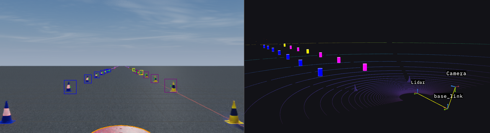

# LiProIC - Lidar Proposal Image Classification
## Overview
This package projects lidar cone detections into a camera images to classify these areas of interest as either a speciffic class of cones or no cone. An overview of the package can also be found in the [KTHFS Wiki](https://wiki.kthformulastudent.se/index.php/LiDAR_Proposal_Image_Classification).

## License
**NO LICENSE!**

**Author:** Kevin Schmidt

**Affiliation:** [KTH Formula Student](https://kthformulastudent.se/)

**Maintainer:** Kevin Schmidt, [kevin.schmidt@kthformulastudent.se](mailto:kevin.schmidt@kthformulastudent.se)

## Installation
### Dependencies
- Robot Operating System (ROS)
- OpenCV
- CUDA
- TensorRT 8

## Usage
Before the package can be used, you have download the model weights that are used for the classification. To do this, follow these steps:
1. get the latest model weights from the KTHFS DV Drive [here](https://drive.google.com/drive/folders/1s9m2v4VQfNpHC2PFVnxf5XnK6eesFqrs)
2. Clone [this repository](https://github.com/KevS272/pytorch_image_classifier) and follow the instructions in the README to convert it into a TensorRT engine
3. Put the created engine file into the `/engines` directory of this package

You also have to specify the correct camera intrinsics and transform in the config file as well as the correct topics and frame IDs in the launch file according to your data.

Then, run the main node with

~~~
roslaunch lidar_proposal_image_classification liproic.launch
~~~

## Config files
Until the package is modified in a way that the node subscribes to the `camera_info` topic to get the current camera parameters, these parameters are stored in .yaml files and loaded using roslaunch (see below). The files are stored in the `/config` folder.

 - `real.yaml` includes intrinsic camera parameters, transform from lidar to camera and more configuration parameters for the node
 - `sim.yaml`  includes intrinsics for the simulated camera and more configuration parameters for the node

## Launch files
This package comes with two launch files: one for real-world use and one for simulation use cases.

- **liproic.launch:** This launches the LiProIC node with standard parameters like actually used sensor topics, frame IDs and camera configuration files.
    - **Arguments:**
        - `sub_topic_cones` the topic with lidar cone detections the LiProIC node should subscribe to. **Default:** `/perception/lidar_cone_detection/cones`
        - `sub_topic_img` the image topic the LiProIC node should subscribe to. **Default:** `/zed/zed_node/rgb/image_rect_color`
        - `sub_topic_cam_info` the camera_info topic the LiProIC node should subscribe to (only necessary if `get_auto_cam_info` = *true*) **Default:** `/zed/zed_node/rgb/camera_info`
        - `frame_id_lidar` the frame ID of the lidar. **Default:** `os_sensor`
        - `frame_id_cam` the frame ID of the camera. **Default:** `zed_left_camera_optical_frame`
        - `get_auto_tf` if *true*, the node subscribes to tf to get the transform, if *false*, the transform from the .yaml file is used. **Default:** `false`
        - `get_auto_cam_info` if *true*, the node subscribes to specified camera_info topic to get the camera parameters, if *false*, the parameters from the .yaml file are used. **Default:** `false`
    - **Rosparam:**
        - `real.yaml` The intrinsic and extrinsic camera paramters that should be used for the projection + classifier configuration (see *Config files* above)
- **sim_liproic.launch:** This launches the LiProIC node with paramters that fits recorded simulation data from Nvidia Isaac Sim (like in the picture above).
    - **Arguments:**
        - `sub_topic_cones` the topic with lidar cone detections the LiProIC node should subscribe to. **Default:** `/perception/lidar_cone_detection/cones`
        - `sub_topic_img` the image topic the projection node should subscribe to. **Default:** `/rgb`
        - `sub_topic_cam_info` the camera_info topic the LiProIC node should subscribe to (only necessary if `get_auto_cam_info` = *true*) **Default:** `/rgb/camera_info`
        - `frame_id_lidar` the frame ID of the lidar. **Default:** `Lidar`
        - `frame_id_cam` the frame ID of the camera. **Default:** `Camera`
        - `get_auto_tf` if *true*, the node subscribes to tf to get the transform, if *false*, the transform from the .yaml file is used. **Default:** `true`
        - `get_auto_cam_info` if *true*, the node subscribes to specified camera_info topic to get the camera parameters, if *false*, the parameters from the .yaml file are used. **Default:** `false`
    - **Rosparam:**
        - `sim.yaml` The intrinsic and extrinsic camera paramters that should be used for the projection + classifier configuration (see *Config files* above)

## Nodes

### LiProIC_node
Reads point cloud and image data, synchronizes them using an approximate time synchronizer and projects the points of the pointcloud into the image plane and draws them onto the image.

#### Subscribed topics
- `~sub_topic_img` [(sensor_msgs/Image)](http://docs.ros.org/en/noetic/api/sensor_msgs/html/msg/Image.html) containing the image the points should be projected on (gets remapped from arg `sub_topic_img`).
- `~sub_topic_cones` [(fs_msgs/Cones)](https://github.com/KTHFSDV/fs_msgs/blob/devel/msg/Cones.msg) containing list of lidar cone detections that should be used as proposals (gets remapped from arg `sub_topic_cones`).
- **OPTIONAL:** `/tf` [(geometry_msgs/TransformStamped)](http://docs.ros.org/en/melodic/api/geometry_msgs/html/msg/TransformStamped.html) to grab lidar/camera transform if arg `get_auto_tf` is set to `true`.
- **OPTIONAL:** `~sub_topic_cam_info` [(sensor_msgs/CameraInfo)](http://docs.ros.org/en/noetic/api/sensor_msgs/html/msg/CameraInfo.html) to grab the camera parameters from the specified `camera_info` topic if arg `get_auto_cam_info` is set to `true`.

#### Published topics

- `/LiProIC_node/cones` [(fs_msgs/Cones)](https://github.com/KTHFSDV/fs_msgs/blob/devel/msg/Cones.msg) The input image with the projected points drawn onto it.
- **OPTIONAL:** `/LiProIC_node/bb_image` [(sensor_msgs/Image)](http://docs.ros.org/en/noetic/api/sensor_msgs/html/msg/Image.html) The input image with the class-colored bounding boxes drawn onto it.
- **OPTIONAL:** `/LiProIC_node/cone_marker_array` [(visualization_msgs/MarkerArray)](http://docs.ros.org/en/noetic/api/visualization_msgs/html/msg/MarkerArray.html) An array with cone markers that can be visualized in Foxglove or RViz.

## Known issues and future improvements
- The projection is not 100% percetly mapped onto the image (see picture above). This is most likely due to incorrect camera parameters.
- The classifier in the image is not yet trained to it's maximum potential. Currently, classifications could be wrong more often than desired. New models will be added shortly to the Drive.
- Currently, the rotational matrix is hardcoded. An additional rotation still has to be added to the code in order to work with the transformations from tf.
